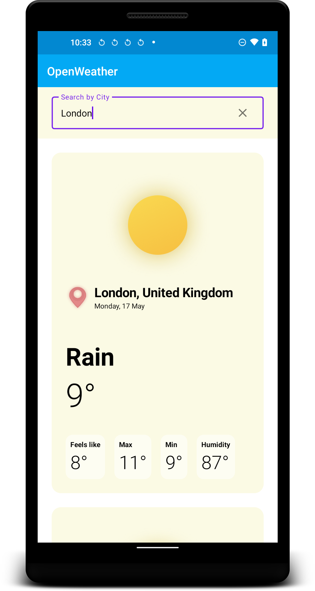

OpenWeather
========

A OpenWeather app implemented using [Open Weather][open_weather_website_link]

💻 Requirements
--------

* To try out these sample apps, you need to use the
latest [Canary version of Android Studio][android_studio_preview_link].

* You can clone this repository or import the project from Android Studio following the
steps [here][jetpack_compose_sample_setup_link].

* add <code>open_weather.api_key={OpenWeather_API_KEY}</code> in <strong>local.properties</strong> file in project root. Check [here][open_weather_website_appid_link] how to get OpenWeather APPID or API_KEY

Sample
-------

|   </img>   OpenWeather App sample    • Search by City • Get Current Weather Details • Can view multiple cities weather details    |  |
|:-----|---------|

License
=======

    Copyright 2021 Ngima Sherpa.

    Licensed under the Apache License, Version 2.0 (the "License");
    you may not use this file except in compliance with the License.
    You may obtain a copy of the License at

       http://www.apache.org/licenses/LICENSE-2.0

    Unless required by applicable law or agreed to in writing, software
    distributed under the License is distributed on an "AS IS" BASIS,
    WITHOUT WARRANTIES OR CONDITIONS OF ANY KIND, either express or implied.
    See the License for the specific language governing permissions and
    limitations under the License.

[open_weather_website_link]: https://openweathermap.org/

[open_weather_website_appid_link]: https://openweathermap.org/appid

[android_studio_preview_link]: https://developer.android.com/studio/preview

[jetpack_compose_sample_setup_link]: https://developer.android.com/jetpack/compose/setup#sample